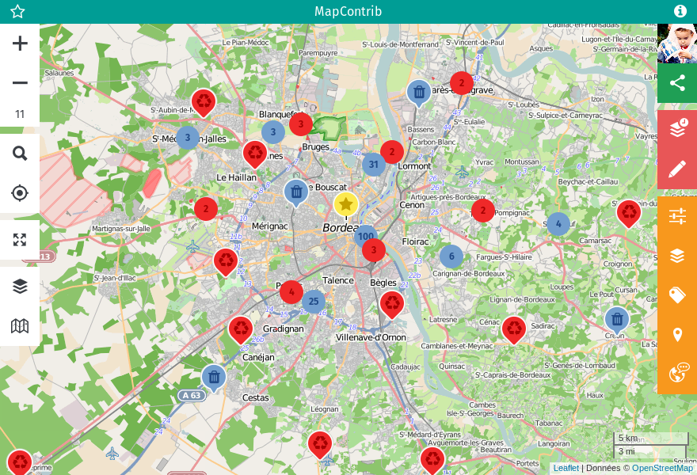

[](http://travis-ci.org/MapContrib/MapContrib)

# 

> Thematic OpenStreetMap contribution



## Informations

* [Blog](https://blog.mapcontrib.xyz)
* [Documentation](http://wiki.openstreetmap.org/wiki/MapContrib)


## Contribution

Informations about contributing are available in the [CONTRIBUTING.md](CONTRIBUTING.md) file.


## Installation

```
$ git clone https://github.com/MapContrib/MapContrib.git
$ cd MapContrib
$ yarn install
$ yarn run build
$ yarn test
```

It will install all the dependancies and test the code.


## OpenStreetMap tokens

In order to let the users log in, you have to register a new app on [osm.org](https://openstreetmap.org). When done, you will have two tokens to put in a new `config/local.yml` file (manual copy of `config/default.yml`).


## Launch the server

By default the application will be available at [http://localhost:8080](http://localhost:8080).

### Docker Compose

#### Launch

To launch the Node.js based server.

```
$ docker-compose up
```

MongoDB is rather slow to create the database files the first time... The Node.js container will surely break.
Just wait a few seconds and rerun the up command.

#### Initial data

Then, you will have to initialize the database, in antoher terminal simply run:

```
$ docker-compose run --rm node npm run init
```

### Manual

#### Configuration

You can create your own configuration file by picking some sections from the `config/default.yml` file.

For example, MapContrib uses MongoDB to store data. By default, it will try to connect to a localhost running MongoDB.
If you want to use a MongoDB server on another host/port/whatever, create a `config/local.yml` file by picking the mongodb section of the `config/default.yml` file and adapt the configuration.

#### Initial data

To initialize the database the first time, run:

```
$ npm run init
```

#### Launch

To launch the Node.js based server.

```
$ npm start
```

## Thanks

MapContrib is what it is because of some crazy people and free and open source projects. Let's name a few:

* Vincent Bergeot: MapContrib's daddy
* Guillaume Amat: MapContrib's main developer
* Frédéric Rodrigo: The force he has ([Osmose](https://github.com/osm-fr/osmose-backend))
* Yohan Boniface ([uMap](https://bitbucket.org/yohanboniface/umap), [Leaflet-Storage](https://github.com/yohanboniface/Leaflet.Storage))
* Noémie Lehuby ([OpenBeerMap](https://github.com/OpenBeerMap/OpenBeerMap.github.io))
* Adrien Pavie ([OpenLevelUp](http://openlevelup.net), [YoHours](http://projets.pavie.info/yohours))
* Maurizio Napolitano ([Github profile](https://github.com/napo))
* Les Libres Géographes
* OpenStreetMap ([OSM](http://osm.org))
* Leaflet ([Website](http://leafletjs.com))
* Overpass API ([Website](http://www.overpass-api.de), [Overpass Turbo](http://overpass-turbo.eu))
* Mapbox ([Website](https://www.mapbox.com))
